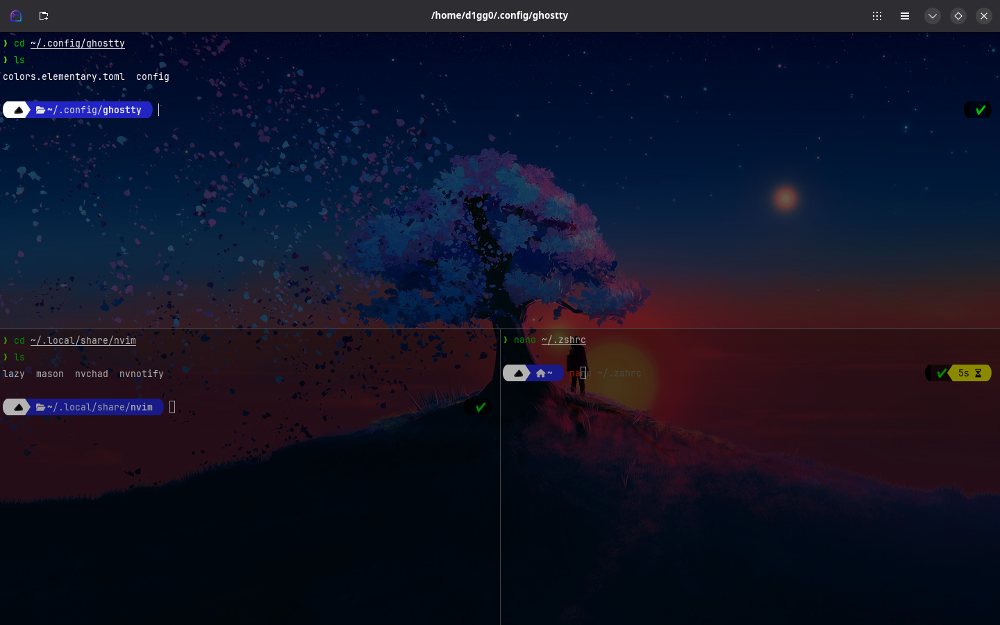

# Ghostty Terminal Setup by D1GG0

### Showcase

---

### About

---

This personalized and optimized configuration for the **Ghostty** terminal emulator, designed to **enhance usability**, **aesthetic fidelity**, and **runtime efficiency**. It is specifically tailored for development environments using **ZSH**, and offers seamless compatibility with both **Wayland** and **X11** display servers.

This configuration was crafted to complement advanced ZSH setups, such as those using Powerlevel10k, zsh-autosuggestions, and zsh-syntax-highlighting, ensuring full glyph rendering and prompt responsiveness.

Whether you're working with tmux, containers, remote SSH sessions, or GUI toolchains, this Ghostty setup delivers a **modern** and **visually consistent terminal experience**, fully aligned with the requirements of contemporary Linux-based workflows.

## Setup on Arch Linux

---

### Backup and Remove Old Nvim Config

---

Backup old ghostty config.

	mv ~/.config/ghostty ~/.config/ghostty-old

Or remove old ghostty config.

	rm -rf ~/.config/ghostty

### Requirements

---

**Step 1 – Install Ghostty**

    sudo pacman -S ghostty

**Step 2 – Install Nerd Font**

    sudo pacman -S ttf-jetbrains-mono-nerd

**Step 3 – Enable `xdg-open` integration**

    sudo pacman -S xdg-utils

### Installation

---

Install the setup.

    git clone https://github.com/d1gg0-dev/ghostty-setup ~/.config/ghostty

You can safely remove the image files.

    rm -rf ~/.config/ghostty/*.jpg
    rm ~/.config/ghostty/*.png

### Technical References

---

For further technical insight into NvChad’s architecture and recommended practices, consult the following official resources:

[Ghostty Official Documentation](https://ghostty.org/docs)

[Ghostty Main Repository](https://github.com/ghostty-org/ghostty)

[Ghostty Config Generator by zerebos](https://github.com/zerebos/ghostty-config)
